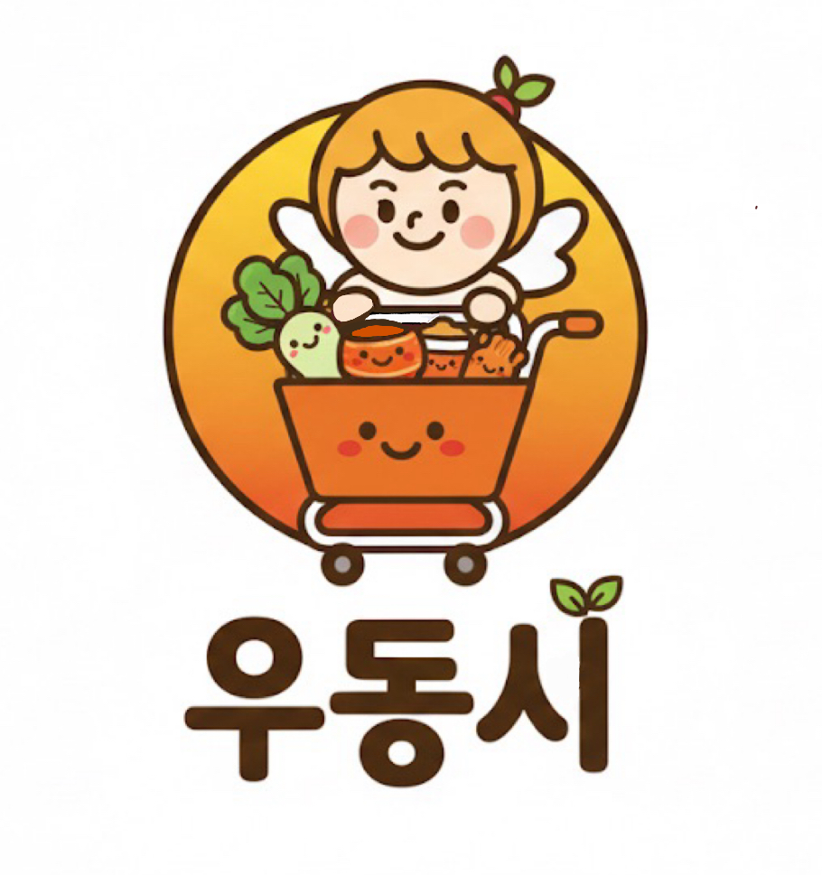

# 우동시(우리동네시장) : </p> 건강한 시장 반찬 공동구매 플랫폼

<p align="center">
  
</p>


## 💡 서비스 소개 (Service Introduction)
우동시(우리동네시장)는 서울 청년 1인 가구가 겪는 균형 잡힌 식사의 어려움과 심화되는 경제적 고통지수 문제를 해결하기 위해 탄생한 재래시장 반찬 공동구매 중개 플랫폼입니다.

현재 청년 1인 가구는 식사 준비의 번거로움과 대용량 구매의 구조적 불리함 때문에 배달/외식에 의존하여 나트륨 과잉 섭취와 영양 불균형 문제를 겪고 있습니다. 우동시는 이러한 청년층의 건강, 경제, 시간 문제를 동시에 해결합니다.

우동시의 핵심은 **연결**입니다.

1. **청년 니즈 해결:** 재래시장 반찬을 1인분 소분 단위로 제공하여 음식물 쓰레기와 잉여 비용을 획기적으로 감소시킵니다. 지역 기반 공동구매 시스템을 통해 묶음 할인 효과를 소분하여 나누고, 편의점 도시락 가격대로 건강한 시장 집밥을 제공합니다.

2. **편의성 극대화:** 퇴근 후 조리, 장보기, 설거지의 시간 및 체력 소모를 없애고, 주문한 반찬을 거점 중심 묶음 배송으로 수령하게 하여 배달비를 획기적으로 절감합니다.

3. **재래시장 활성화:** 시장 상인에게는 예측 가능한 대량 주문을 확보하게 하여 재고 부담과 폐기율을 낮추고, 청년층을 재래시장의 새로운 소비층으로 유입시켜 지역 상생의 가치를 창출합니다.

## 🛠️ 서비스 핵심 기능 (Core Features)
### 1. 🔍 탐색 및 조회 기능

우동시의 모든 조회 API는 **현재 공동 구매 현황 정보**를 포함하고 있어, 사용자가 구매 결정에 필요한 모든 정보를 한 번에 얻을 수 있도록 구성되어 있습니다.

- **통합 검색 및 필터링 (0. 검색):** 근처 시장에 있는 모든 반찬을 **키워드(가게명, 반찬 종류)**를 통해 검색하며, 카테고리(육류, 생선 등)를 조합하여 원하는 반찬을 쉽게 찾을 수 있습니다.

- **시장/가게 탐색 (1.1, 2.2):** GPS 기반으로 주문 가능한 시장을 리스트업하고, 사용자가 **선택한 시장의 가게별 상품 목록**을 조회합니다.

- **시간대별 상품 조회 (2.1, 2.2):** 반찬 가게의 영업시간을 반영하여 **오전/오후** 공동구매 시간에 맞는 메뉴만 출력하며, 특가 상품이나 추천 상품은 메인 페이지 배너에 노출됩니다.

- **실시간 공구 현황:** 모든 반찬의 상세 페이지에서 **현재 공동 구매 참여 인원**과 **임계 인원(Threshold)**을 실시간으로 확인할 수 있습니다.

### 2. 🛒 장바구니 및 공동 구매 관리 기능
- **반찬 상세 페이지 및 담기 (4. 반찬 상세페이지 및 담기):** 원하는 반찬의 상세 정보(이름, 가격, 공동구매 인원 현황)를 확인하고, 장바구니에 담습니다.

- **UPSERT 방식 장바구니 담기:** ```POST /api/cart/items```를 통해 원하는 반찬을 장바구니에 담으며, 이미 담은 상품은 수량이 자동으로 누적되어 업데이트됩니다.

- **장바구니 목록 확인 (5. 장바구니 목록 확인):** [시장별]로 분류된 반찬 리스트를 확인하며, 수량, 가격, 공구 참여 인원 현황을 한눈에 볼 수 있습니다.

- **주문 확정 시스템:** 결제는 **가결제** 상태로 진행되며, 마감 시간까지 **임계 인원**이 달성되면 주문이 확정되고, 미달 시 자동 환불 처리되어 경제적 손실 위험이 없습니다.

### 3. 🛵 배송 시스템
- **거점 중심 공동 배송:** 동 단위로 자동 생성된 공동구매 팟을 기반으로, 아파트 단지나 오피스 로비 등 **특정 거점**에 **묶음 배송**을 진행하여 1회 배달로 N명이 동시에 수령하는 구조를 설계했습니다. 이는 배달비를 획기적으로 절감하는 핵심 구조입니다.

## 🧑‍💻 각 팀원의 상세 수행 내용
본 프로젝트는 다음과 같은 역할 분담을 통해 성공적으로 완료되었습니다.
### - **PM 김정호:** 
**프로젝트의 기획 정리 및 비즈니스 모델(BM) 수립**을 담당했습니다. </p>
문제 정의부터 해결책 제시, 시장 및 경쟁사 분석, 비즈니스 모델 구상 및 자료 조사를 진행했으며, 초기 백지 PPT 작성을 주도하고 프로젝트의 방향성을 확립하여 최종 발표를 진행했습니다.
### - **BE 김연수:** 
**전체 백엔드 API 개발** 및 **DB 구조 안정화를 총괄**했습니다.</p>
프로젝트 DB (MySQL)의 ERD 설계 및 실제 구현을 완료하고, api.php의 프론트 컨트롤러 라우팅 구조를 확립하여 Core API 4종 (Home, Markets, Categories, Cart)의 모든 엔드포인트 구현을 책임졌습니다. 특히, 라우팅 충돌 해결과 함께 수동 PK 할당 및 user_id 타입 불일치와 같은 특수한 DB 제약 조건 문제를 해결하여 백엔드 비즈니스 로직의 안정성을 최종적으로 확보했습니다.
### - **FE 조예린:** 
**초기 아이디어 제시** 및 **프론트엔드 아키텍처 및 핵심 기능 구현**을 담당했습니다. FE 디렉터리 구조 설계와 상태 관리 시스템의 초기 설계를 맡았으며, 마이페이지 및 홈 페이지의 핵심 화면 구현을 완료했습니다. 개발된 백엔드 API 명세를 기반으로 전체 프론트엔드 코드의 API URL 연결 및 데이터 연동 작업을 책임져 프론트와 백엔드의 최종 통합을 수행했습니다.
### - **FE 박서현:** 
**서비스 디자인 검토 및 수정을 주도**했습니다. </p>
홈 화면, 카테고리 화면, 장바구니, 결제창 등 핵심 사용자 인터페이스(UI) 구현을 담당했습니다.
                앱의 복잡한 화면 흐름을 위해 네비게이션 구조를 표준적으로 중첩하여 구축했으며, 장바구니 상태 관리 시스템을 도입하여 상품 담기, 수량 조절 시 자동 삭제와 시장별 그룹화 등의 비즈니스 로직을 완성했습니다.
### - **디자이너 김민준:** 
**서비스 아이디어 구체화 및 UX 기획**을 맡았습니다.</p>
이를 통해 비즈니스 모델을 실제 서비스 형태로 구현하는 데 핵심적인 역할을 했습니다. 와이어프레임(Wireframe)작성부터 Figma 기반의 최종 UI/UX 시안까지 완성하여 개발팀의 기반을 마련했습니다. 서비스의 브랜딩, 톤앤매너, 컬러 팔레트를 확립하고, 개발 이후 최종 디자인 검토 및 품질 확인을 담당했습니다.


### @ 2025 Hackathon | 서울러 by NEXA